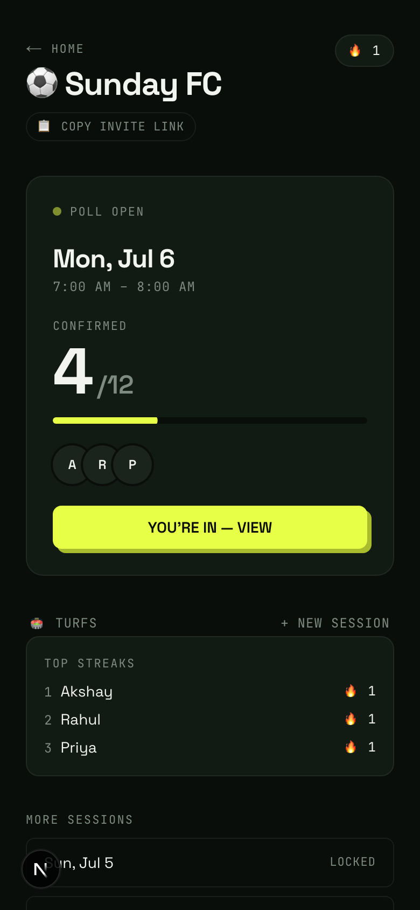
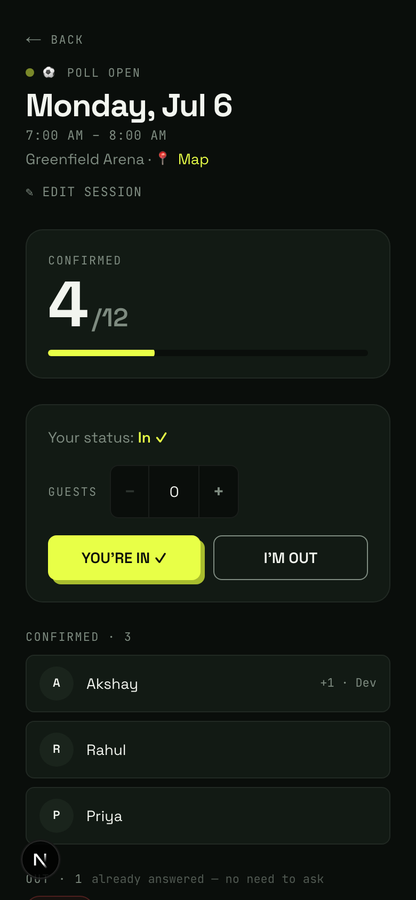
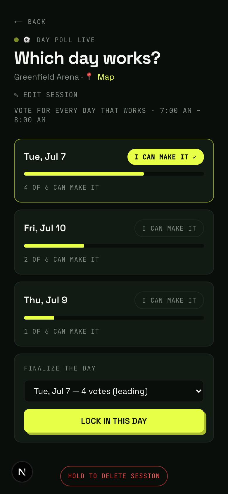
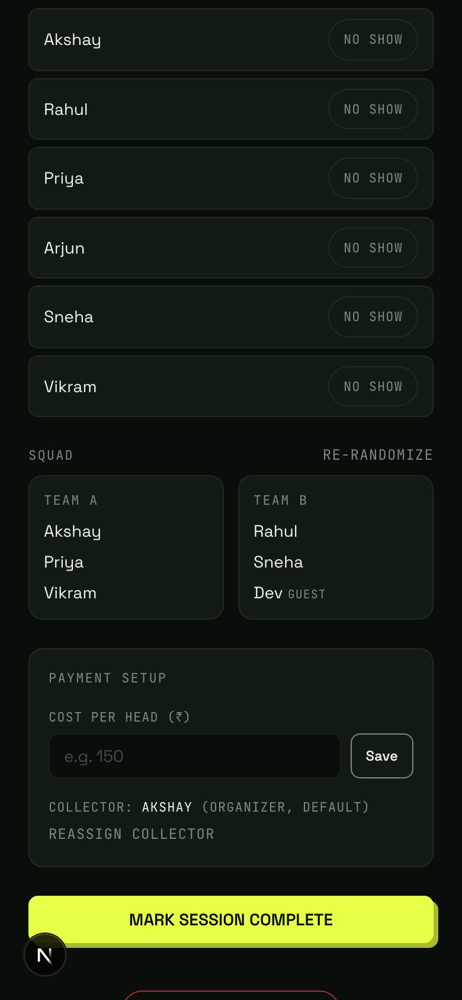
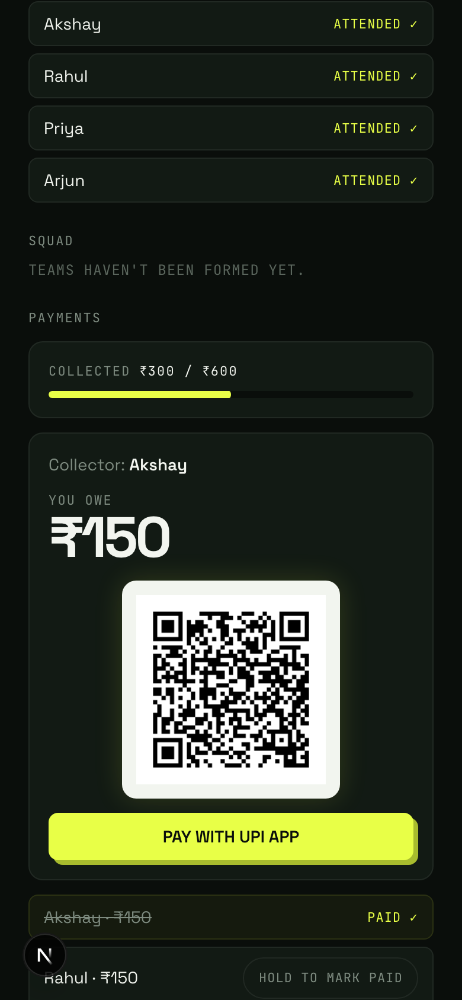
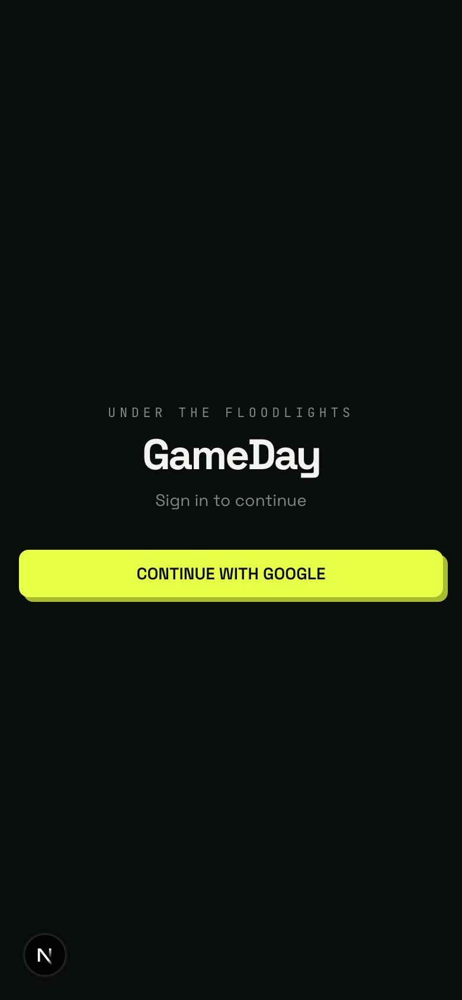

# ⚽ GameDay

**Under the floodlights.** The weekly game, minus the group-chat chaos.

🔗 **Live:** [itsgameday.vercel.app](https://itsgameday.vercel.app)

---

## The Story

Every friend group that plays a weekly sport knows this ritual:

> *"Guys, football this Saturday?"*
>
> 47 messages later — three "in"s, one "maybe", two people asking what time, someone asking which turf, the same question answered four times, and one guy who said "in" but everyone knows he won't show. Thursday night, the organizer is scrolling up through the chat, manually counting heads on their fingers.
>
> Saturday comes. Twelve people confirmed, nine turn up. The organizer paid ₹1,800 for the turf up front. Now begins the second ritual: chasing people for their share, one awkward "bro, payment?" at a time. By the next week, nobody remembers who paid and who didn't.
>
> And then someone says: *"okay so how are we splitting teams?"*

WhatsApp is where the game gets **talked about**. It's a terrible place for the game to get **organized**. The poll gets buried, the headcount is always stale, the waitlist doesn't exist, the money is on trust, and the teams are picked by whoever argues loudest.

**GameDay is the missing layer.** One link in the group chat. Everything else — voting, headcount, waitlist, teams, payments — handled.

---

## What It Does

### 🗳️ One tap to commit
No more "who's in?" archaeology. The organizer creates a session; everyone taps **I'M IN** or **I'M OUT**. The headcount is live, always accurate, and visible to everyone. You can even see who's *yet to vote* — so you nudge only the people who actually haven't answered, instead of spamming the whole group.

### 📅 Can't agree on a day? Let the group vote
Start a **day poll** with candidate days. Everyone marks which days work. The organizer locks in the winner. Done — no 60-message negotiation.

### 🎟️ Capacity & waitlist, handled
Turf fits 12? The 13th person to vote lands on a waitlist automatically. Someone drops out? The next in line is promoted. Nobody has to referee it.

### 👥 Guests welcome
Bringing your cousin? Add him as a named guest. He counts toward the headcount, gets his own slot in the teams, and gets included in your share of the cost.

### 🎲 Fair teams in one tap
When the poll closes, hit **FORM TEAMS** — a fair random shuffle deals everyone (guests included) into two squads, with a proper card-shuffle reveal ceremony. No captains' egos, no "same teams as last week."

### 💸 Payments without the awkwardness
Set the cost per head. When the session completes, everyone's share is calculated automatically (guests billed to whoever brought them). Members pay the collector via **UPI** — QR code and deep link included — and mark themselves paid with a hold-to-confirm. The collector sees a live "collected so far" bar. No spreadsheets, no chasing, no forgotten dues.

### 🏟️ Your turfs, remembered
Save the turfs your group actually plays at — with a map pin, not an address nobody reads. They surface first every time someone creates a session, and the session page links straight to Google Maps for the one friend who's always lost.

### 🔥 Streaks & attendance
Attendance is marked per session, and showing up builds a streak. Miss a week, streak resets. Gentle, public accountability for the "in"-but-never-shows crowd.

### 🔗 Invites that just work
One invite link, dropped once in the group chat. Anyone who clicks it lands in the group — signed in with Google in a single tap. No forms, no OTPs, no friction.

---

## A Look Around

<table>
  <tr>
    <td align="center"><br/><sub><b>The group hub</b> — one glance, the whole picture</sub></td>
    <td align="center"><br/><sub><b>One-tap voting</b> — guests included</sub></td>
    <td align="center"><br/><sub><b>Day polls</b> — the group picks the day</sub></td>
  </tr>
  <tr>
    <td align="center"><br/><sub><b>Fair squads</b> — one tap, guests get slots too</sub></td>
    <td align="center"><br/><sub><b>Settling up</b> — UPI QR, live collection bar</sub></td>
    <td align="center"><br/><sub><b>Zero-friction entry</b> — one tap with Google</sub></td>
  </tr>
</table>

---

## The Feel

GameDay doesn't look like an admin tool, because organizing the week's game shouldn't feel like filing a report. The design system — **"Floodlit"** — is a turf at night under floodlights: everything dark except what matters, one floodlight-yellow action per screen, buttons that physically depress when pressed, numbers that count up instead of jumping, and small ceremonies for the moments that deserve them — locking in your spot, the squad reveal, settling the last payment, a streak milestone.

It's built mobile-first, because that's where the group chat lives.

---

## Under the Hood

| Layer | Tech |
|---|---|
| Frontend | Next.js (App Router) · React · Tailwind CSS · Motion |
| Auth | Firebase (Google Sign-In) bridged to Supabase JWTs |
| Database | Supabase (Postgres + Row Level Security) |
| Maps | Leaflet + OpenStreetMap (no API keys) |
| Payments | UPI deep links + QR codes |
| Hosting | Vercel |

### Running locally

```bash
pnpm install
cp .env.local.example .env.local   # fill in Supabase + Firebase credentials
pnpm dev
```

Apply the SQL migrations in `supabase/migrations/` (in order) to your Supabase project, and enable Google as a sign-in provider in Firebase.

For the full engineering picture — architecture, auth flow, data model, permissions, business logic, and deployment — see **[DOCUMENTATION.md](DOCUMENTATION.md)**.

---

*Built for one WhatsApp group that was tired of counting heads. Yours is probably the same.*
